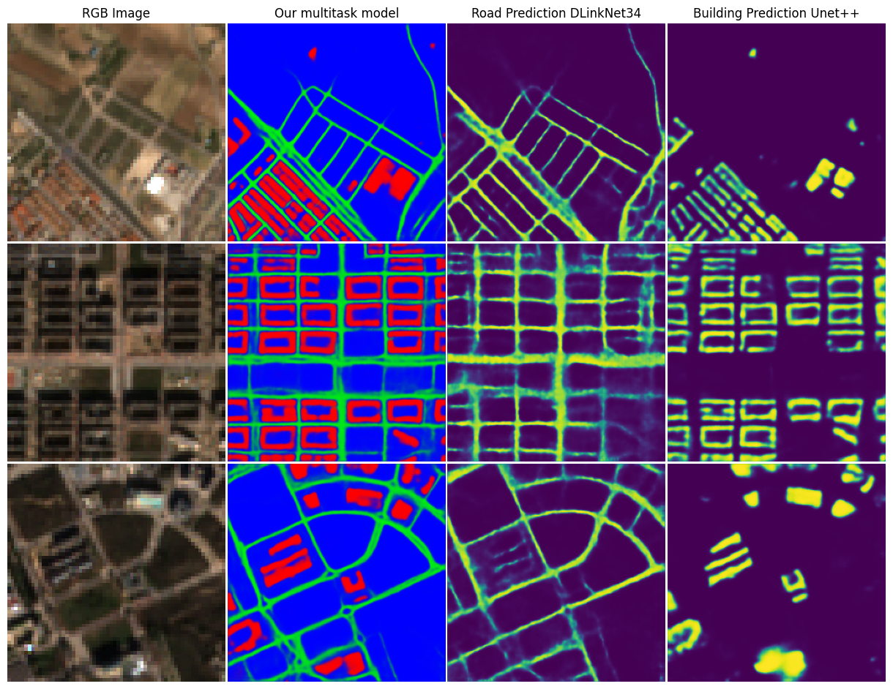

# 🏗️ Multitemporal Change Detection in Building and Roads 🏢🛣️
### 📜 [Project Page](https://jfloresf17.github.io/scburningweb) | 💻 [Thesis](https://drive.google.com/file/d/1ckUoqfnjuXIhjHmnjANw6RWyh8ZkIWrt/view?usp=sharing) | 📈 [Data](https://drive.google.com/file/d/1B2yOwdJ7DoVI2xtdM6NHmdFpyQgQpfGv/view?usp=drive_link) | 📏 [Experiment Logs](https://wandb.ai/scigeo/BR-Segmentation)
[](https://colab.research.google.com/drive/1Yl2Rxv4e45JJ-ydmpUbXPAxVd0OZ7gNz?usp=sharing)

## 🛠️ Installation Requirements
To set up the environment, follow these steps:
1. Clone the repository:
    ```bash
    git clone https://github.com/jfloresf17/brcd.git
    cd brcd
    ```
2. Create a Python environment (optional but recommended):
    ```bash
    python -n env brcd_env python=3.10
    conda activate brcd_env
    ```
3. Install the required packages:
    ```bash
    pip install -r requirements.txt
    ``` 
   
## 💾 Data
### 📁 Folder Structure
The dataset should be organized in the following structure:
```
data/
└── s2/
└── s1/
└── roads/
└── buildings/
```

### 🐙 Structure of the repository
```
brcd/
├── assets/                 # Images and diagrams for the README
├── data/                   # Directory for datasets
├── models/                 # Pre-trained models
├── notebooks/              # Jupyter notebooks for experiments and visualizations
├── src/                    # Source code for data processing, model training, and evaluation
├── tests/                  # Unit tests for the codebase
├── .gitignore              # Git ignore file
├── README.md               # Project documentation
├── requirements.txt        # List of required Python packages
└── setup.py                # Setup script for the project
```

## 🗃️ General Workflow
The following diagram illustrates the workflow of data processing, model training, and evaluation for multitemporal change detection in buildings and roads using satellite imagery (Sentinel-1 and Sentinel-2):

<p align="center">
  
</p>

## 🏆 Results
### 📈 Quantitative Results
The following table summarizes the quantitative results of our models on the test set:
| **Model**           | **Building IoU** | **Building F1** | **Road IoU** | **Road F1** |
|---------------------|------------------|-----------------|--------------|--------------|
| **Collaborative Model**           | 0.76             | 0.86           | 0.65         | 0.79         |
| **UNet++ (buildings)**        | 0.74             | 0.85           | -            | | -            |
| **DLinkNet-34 (roads)**  | -                | -              | 0.63         | 0.78         |

For the change detection method using multitemporal change indicators, we achieved the following results:
| **Change Detection Method** | **Accuracy Top-1** | **Accuracy Top-3** | **NCBA** |
|-----------------------------|--------------------|--------------------|----------|
| **Edificios** | 0.92               | 0.97               | 0.89     |
| **Carreteras** | 0.90               | 0.95               | 0.87     |

### 🖼 Qualitative Results
The following images illustrate the qualitative results of our models on sample test images:
<p align="center">
  
</p>

## 👨‍💻 Inference (Try the Model)
### 🔗 Pre-trained Models
You can use the pre-trained models available here:

| **Model**           | **Link** | **Size** |
|---------------------|-----------|----------|
| **Collaborative Model**           | [📥 Download](https://drive.google.com/file/d/1TrZpdEZarFu6AgtrN4fWCmUIo7YfMdvw/view?usp=drive_link) | 1.02 GB |
| **UNet++ (buildings)**        | [📥 Download](https://drive.google.com/file/d/1URanGAOWgPF6Kcq_xN5NveAivDLw1S1u/view?usp=drive_link) | 862.1 MB |
| **DLinkNet-34 (roads)**  | [📥 Download](https://drive.google.com/file/d/1UuHriNcd5OIxN8quu-aYwa9YKFIJq0_g/view?usp=drive_link) | 280.4 MB |

## 📜 Citation

